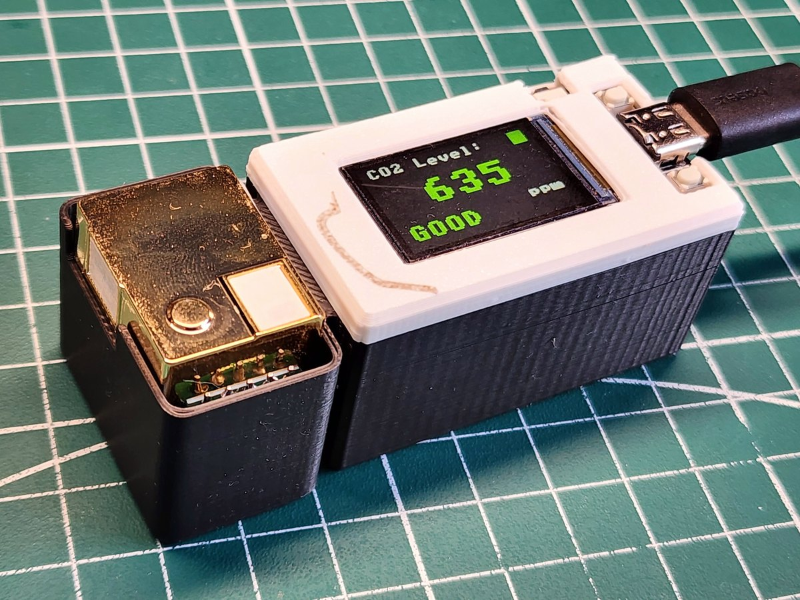

# mhz19b-ttgo-co2-meter

**A desk meter that tells you when to open a window. One number, one colour, and a new reading every five seconds.**

[](https://github.com/ashbmstu/mhz19b-ttgo-co2-meter/actions/workflows/ci.yml)
[](LICENSE)


An **MH-Z19B** infrared sensor and a **LILYGO TTGO T-Display**, in a printed
box. Carbon dioxide indoors is mostly you, breathing, so the number on the front
is really a measure of how well the room is keeping up with the people in it.

It is drawn large enough to read from across a room, in green, yellow or red,
with a one-word verdict underneath. Four wires and no circuit board.

<p align="center">
  
</p>

## What it shows

| | |
|---|---|
| **Carbon dioxide** | ppm, from an NDIR infrared sensor |
| **A colour** | Green below 800, yellow to 1200, red above |
| **A verdict** | `GOOD`, `FAIR` or `POOR`, for reading at a glance |
| **Refresh** | Every 5 seconds, showing the latest reading rather than an average |
| **Size** | 80 × 36 × 27 mm, the printed body |

## What you need

| Part | Approx. |
|------|--------|
| LILYGO TTGO T-Display V1.1 | ~£12 |
| MH-Z19B carbon dioxide sensor | ~£20 |
| Four jumper wires | |
| Printed case | |

No battery and no circuit board. Full detail in [docs/hardware.md](docs/hardware.md).

> [!WARNING]
> **This does not detect carbon monoxide.** Carbon dioxide and carbon monoxide
> are different gases, and the one that kills people in homes is the one this
> sensor is blind to. A meter reading a comfortable 500 ppm proves nothing about
> a faulty boiler or a blocked flue. Buy a certified CO alarm, and do not let a
> box full of electronics give you the impression you already have one.

## Quick start

1. **Put MicroPython on the board.** It needs a particular build, because the
   display driver is compiled in. [docs/flashing.md](docs/flashing.md) walks
   through it. Once only, about fifteen minutes.
2. **Copy three files onto the board** — everything in `src/` except
   `config.example.py`.
3. **Connect four wires.** Power, ground, and one each way for the data. The
   diagram in [docs/hardware.md](docs/hardware.md) shows all four.
4. **Print the case** from [Thingiverse](https://www.thingiverse.com/thing:7280723).
5. **Plug in the USB cable.** `Sensor OK` appears, then a reading.

**Wait three minutes before believing anything.** The sensor has to warm up, and
until it does it reports a flat number that means nothing. This catches
everybody once.

## Reading the numbers

| ppm | On screen | What it means |
|---|---|---|
| **400 – 600** | `GOOD` | Outdoor air, or a window open |
| **600 – 800** | `GOOD` | Normal occupied room. Nothing to do |
| **800 – 1200** | `FAIR` | Ventilation is falling behind |
| **1200 – 2000** | `POOR` | Noticeably close. Headaches and dullness live here |
| **2000 +** | `POOR` | Open something |

Outdoor air is 400 to 450 ppm almost everywhere on earth, which makes the meter
easy to sanity-check: take it outside and see.

## What you can use it for

- **Knowing when to open a window**, rather than guessing. A bedroom with the
  door shut passes 1500 ppm overnight surprisingly often.
- **Settling the argument about the meeting room** before the meeting rather
  than after it.
- **Checking that a trickle vent, an extractor or an air brick does anything.**
  Watch how long the number takes to fall after you open something.
- **Working out where to sit.** Rooms are not uniform, and neither are desks.
- **Showing children what breathing does to a room** — breathe at it from 30 cm
  and the number climbs while they watch.

## How it works

```
MH-Z19B ──UART1, 9600──▶ TTGO T-Display V1.1 ──SPI──▶ 1.14-inch IPS
NDIR CO2 sensor           ESP32                        135 × 240
GPIO25 / GPIO26           main.py                      ST7789V
                             │
                             └─ optional ─▶ Wi-Fi ─▶ ThingSpeak
                                only when a config.py is present
```

Every five seconds the firmware sends the sensor a nine-byte command, checks the
checksum on the reply, and redraws the panel. The digits are drawn by scaling an
8 × 8 bitmap font up by five, which is why they look like a cash register — the
display driver has no large fonts, and this way needs no extra files.

<p align="center">
  
</p>

The sensor sits in an open bay rather than inside the box. It has to breathe the
room; a sensor sealed in a case measures the case.

## Publishing readings

The meter can post each reading to a free **ThingSpeak** channel and give you a
chart instead of a snapshot. It is off unless you turn it on: without a
`config.py` on the board the firmware never imports the networking modules and
never switches the radio on. Five minutes to set up —
[docs/thingspeak.md](docs/thingspeak.md).

No credentials live in this repository, and `config.py` is in `.gitignore` so
that yours do not end up in a fork of it.

## Limitations

- **Carbon dioxide only.** Not carbon monoxide, not smoke, not solvents, not
  cooking fumes. See the warning above.
- **USB only.** The sensor needs 5 V, which the board only has from USB. A
  battery would run the screen and starve the sensor, so there is no battery.
- **Three minutes of nonsense at every power-on** while the sensor warms up.
- **±(50 ppm + 5% of the reading)** at best, per the datasheet — and in practice
  the baseline matters more than the specification. See
  [docs/measurement.md](docs/measurement.md).
- **No pressure compensation.** NDIR readings fall with air pressure. Worth
  knowing if you live at altitude; ignorable at sea level.
- **It twitches.** Readings are drawn as they arrive with no averaging, so the
  noise of the sensor is visible. The trend over a minute is the real signal.
- **No logging and no clock.** The meter shows the present moment and remembers
  nothing.
- **Self-calibration is switched off** in favour of doing it by hand, which
  suits a room that is rarely aired and means the reading will wander over
  months. [docs/measurement.md](docs/measurement.md) explains both sides.

## The case

The box body is on Thingiverse: **[thing:7280723](https://www.thingiverse.com/thing:7280723)**.
Printed at 0.2 mm with no supports.

It is a remix, and the face that covers the board comes from
**[thing:3777859](https://www.thingiverse.com/thing:3777859)** by **vmensik** —
download that one too. The case is Creative Commons Attribution-ShareAlike,
which is not the licence covering the firmware here. See [NOTICE](NOTICE).

## Documentation

| | |
|---|---|
| [flashing.md](docs/flashing.md) | MicroPython, the display driver and copying the files. **Start here.** |
| [hardware.md](docs/hardware.md) | Parts, wiring diagram, every connection, assembly order |
| [measurement.md](docs/measurement.md) | Warm-up, accuracy, baseline drift and calibrating by hand |
| [thingspeak.md](docs/thingspeak.md) | Optional: charting the readings over time |
| [troubleshooting.md](docs/troubleshooting.md) | Symptom-first fault finding |

## Project status

Working and in daily use. Version 0.1.0 — see [CHANGELOG.md](CHANGELOG.md).

## Contributing

Readings from a meter you have built are the most useful thing, particularly
alongside a reference instrument. See [CONTRIBUTING.md](CONTRIBUTING.md).

## Licence

MIT — see [LICENSE](LICENSE). Third-party attributions in [NOTICE](NOTICE).

The firmware here is this project's own. The display driver it depends on is a
C module compiled into the MicroPython build, and the printed case is Creative
Commons Attribution-ShareAlike.
