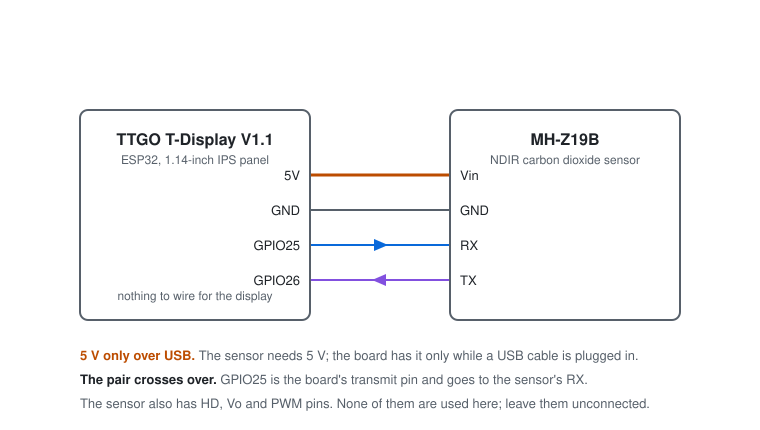
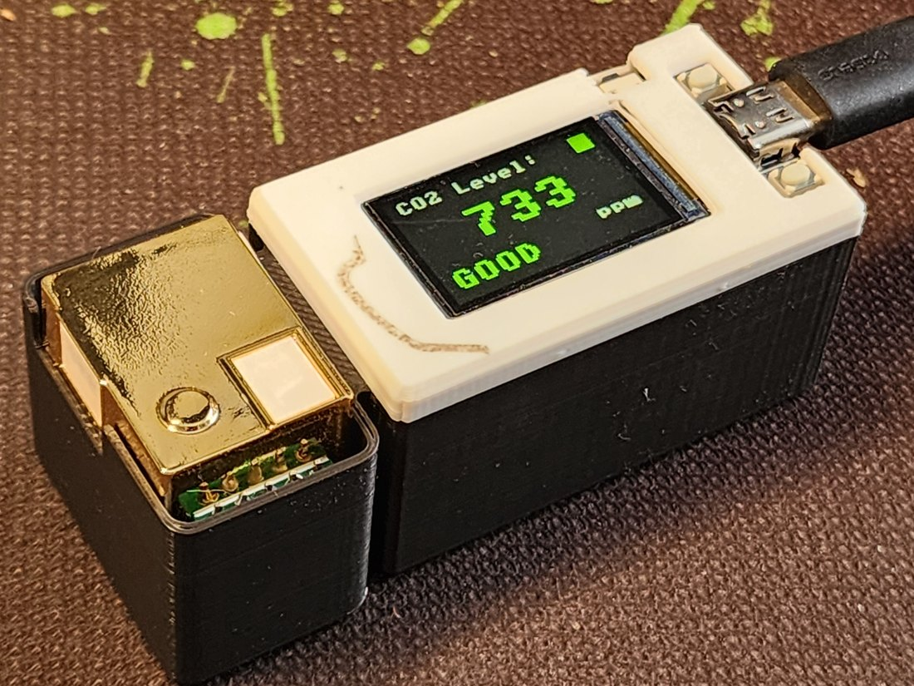

# Hardware

Parts, wiring and assembly. Four wires, no circuit board.

## Parts

| Part | Notes |
|---|---|
| **LILYGO TTGO T-Display V1.1** | ESP32 with a 1.14-inch IPS panel, 135 × 240, driven by an ST7789V. The board already carries the display, two buttons, a USB port and a battery connector |
| **MH-Z19B** | NDIR carbon dioxide sensor. Sold in several ranges — 0–2000, 0–5000 and 0–10000 ppm — and the label on the module says which one you have. The firmware reads whatever it reports |
| **Four jumper wires** | Female-to-female if your sensor came with its header soldered on |
| **Printed case** | [thing:7280723](https://www.thingiverse.com/thing:7280723) |

That is the whole bill of materials. There is no battery in this build, and
[there cannot usefully be one](#why-there-is-no-battery).

## Wiring

  

| From | To | GPIO |
|---|---|---|
| MH-Z19B `Vin` | T-Display `5V` | — |
| MH-Z19B `GND` | T-Display `GND` | — |
| MH-Z19B `RX` | T-Display `25` | GPIO25 |
| MH-Z19B `TX` | T-Display `26` | GPIO26 |

The board **transmits** on GPIO25 into the sensor's RX pin, and **receives** on
GPIO26 from its TX pin. Swapping those two is the usual reason a freshly built
meter shows `Sensor FAIL`, and it does no damage — try it the other way round.

The sensor's remaining pins are `Vo`, an analogue output, `PWM`, a
pulse-width output carrying the same reading, and `HD`, which triggers a manual
zero calibration when it is held low. This firmware uses none of them. Leave
them unconnected; `HD` in particular should not be tied low, or the sensor will
recalibrate itself to 400 ppm wherever it happens to be sitting.

## Why there is no battery

The MH-Z19B runs on 5 V. The T-Display's `5V` pin is USB power passed through —
the battery connector is 3.7 V and there is no boost converter on the board. So
a cell would power the ESP32 and the screen, and the sensor would go quiet.

This meter is a desk instrument that lives on a USB cable. If you want one that
can be carried outside to see fresh air, that is a different sensor and a
different build.

## The display

Nothing is soldered for the panel. These are the connections already made on
the board, and the numbers `src/tft_config.py` expects:

| Signal | Board pad | GPIO |
|---|---|---|
| `MOSI` | `19` | GPIO19 |
| `SCLK` | `18` | GPIO18 |
| `CS` | `5` | GPIO5 |
| `DC` | `16` | GPIO16 |
| `RST` | `23` | GPIO23 |
| `BL` | `4` | GPIO4 |

They are listed because the T-Display has been through several revisions. If
your panel stays black while the console prints readings, this table and
`src/tft_config.py` are the first place to look.

## Assembly order

1. **Solder the four wires to the T-Display's header before the board goes in.**
   Standard header pins are too long to close the case: use short pins, solder
   the wires straight to the pads, or bend the pins over to about 45°.
2. **Test it on the bench, out of the case.** You should get `Sensor OK`, then a
   reading about five seconds later. It is much easier to fix a swapped pair now
   than after everything is screwed together.
3. **Drop the sensor into its bay** with the gold can facing up and the metal
   gauze windows clear. The bay is open on purpose — the sensor has to breathe
   the room, and a sealed box measures nothing but its own contents.
4. **Fit the board and close the face over it.**

  

## The case

The box body is on Thingiverse: **[thing:7280723](https://www.thingiverse.com/thing:7280723)**,
as `Box_dnoMirror.stl` with a STEP file beside it for editing.

It is a remix. The face that covers the board comes from
**[thing:3777859](https://www.thingiverse.com/thing:3777859)** by **vmensik**,
and you need to download that one too — the body here adds the sensor bay and
nothing else. Both are Creative Commons Attribution-ShareAlike, which is a
different licence from the MIT terms covering the firmware. See [NOTICE](../NOTICE).

Printed in the photographs at 0.2 mm in black PLA with a white face, no
supports.

## Related

- [flashing.md](flashing.md) — MicroPython, the ST7789 module, and copying the files
- [measurement.md](measurement.md) — warm-up, calibration and how far to trust a reading
- [thingspeak.md](thingspeak.md) — optional: publishing readings to a chart
- [troubleshooting.md](troubleshooting.md) — symptom-first fault finding
